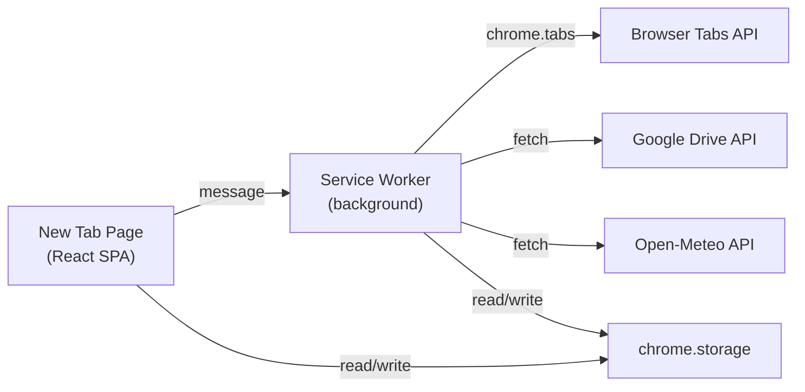

# 新标签页浏览器扩展 PRD（Chrome / Firefox）

> 本 PRD 面向 **AI 编码助手** 直接读取并执行开发，同时也可作为人类开发者的需求规范。文档采用「用户需求 → 产品设计 → 技术实现」三层结构，所有章节均含可验收的 **Acceptance Criteria**。
> 

## 0. 文档信息

| 项目 | 内容 |
| --- | --- |
| 产品名称 | **LeLe Tab** |
| 文档版本 | v1.0 |
| 目标平台 | Chrome（Manifest V3）+ Firefox（WebExtensions，MV3 兼容） |
| 文档类型 | PRD（Product Requirements Document） |
| 读者 | AI 开发助手 / 前端开发 / 扩展开发工程师 |
| 语言 | 界面默认中文，支持英文切换 |

---

## 1. 产品背景与目标

### 1.1 产品定位

一款替换浏览器默认新标签页的扩展，提供**聚合式工作台**（Dashboard）：日历、天气、待办、书签、已打开标签页速览等模块，视觉风格对齐 **Anthropic Claude 官网** 的极简、暖色、高质感设计语言。

### 1.2 核心价值

- **聚焦**：打开新标签页即进入个人工作台，减少无效跳转。
- **一致性**：书签通过 Google Drive 以标准 HTML 格式同步，跨设备、跨浏览器通用。
- **防误关**：关闭最后一个标签页自动重开新标签页，避免误关浏览器。
- **美观**：Claude 级别的视觉体验，替代千篇一律的速拨页。

### 1.3 非目标（Out of Scope v1.0）

- 不做全量浏览器历史记录管理。
- 不做多账号 Google Drive 同步（v1 仅支持单账号）。
- 不做移动端（仅桌面 Chrome / Firefox）。
- **不接入任何第三方服务**（不接 Google Calendar、Todoist、Notion、iCloud 等）。所有需要跨设备同步的数据（日历事件、待办、书签、归档标签页、设置）**一律通过用户自己的 Google Drive 指定路径**同步。

---

## 2. 用户画像与使用场景

### 2.1 目标用户

- 重度浏览器使用者（开发者、研究者、学生、产品经理）。
- 追求极简美学、有 Claude / Notion / Linear 审美偏好的用户。
- 有跨设备同步书签需求、但不信任浏览器自带同步的用户。

### 2.2 典型场景

1. 早上开机 → 新建标签页 → 看到今日日历 + 天气 + 待办，规划一天。
2. 工作中打开了 30 个标签页 → 新建标签页 → 在「已打开标签页」模块快速跳回。
3. 换设备（家里 Mac → 公司 Windows）→ 登录同一 Google 账号 → 书签自动同步。
4. 手滑关闭了最后一个标签页 → 浏览器不退出，自动重开新标签页。

---

## 3. 功能需求（Functional Requirements）

### 3.1 F1 — 新标签页替换

**描述**：用户打开新标签页（Ctrl/Cmd+T、点击 + 号、关闭最后一个标签页后自动打开）时，加载本扩展自定义页面。

**详细需求**：

- 使用 `chrome_url_overrides.newtab`（Chrome）与等价的 Firefox 清单字段。
- 新标签页加载时间 **< 300ms**（首屏，使用缓存数据）。
- 支持用户在设置中**一键禁用**，恢复浏览器默认新标签页。

**验收标准**：

- [ ]  Ctrl/Cmd+T 打开的是自定义页面。
- [ ]  通过地址栏访问 `chrome://newtab` / `about:newtab` 也加载该页面。
- [ ]  禁用扩展后恢复默认行为。

---

### 3.2 F2 — 视觉风格（Claude 风格）

**描述**：页面整体视觉参考 [claude.ai](http://claude.ai) 官网首页。

**设计规范**：

| 维度 | 规范 |
| --- | --- |
| 主色调 | 暖米白底 `#F5F1EB` / `#FAF9F5`（浅色），深炭灰 `#1F1E1D`（深色） |
| 强调色 | Claude 橙 `#D97757` 用于 CTA、高亮、品牌点缀 |
| 字体 | `Styrene`/`Tiempos`/`Inter` 无版权替代：`"Söhne", "Inter", system-ui, -apple-system, sans-serif`；标题可用衬线 `"Tiempos Headline", "Source Serif Pro", serif` |
| 圆角 | 卡片 12–16px，按钮 8–10px |
| 阴影 | 极轻：`0 1px 2px rgba(0,0,0,0.04), 0 4px 16px rgba(0,0,0,0.04)` |
| 间距 | 8px 基准网格 |
| 动效 | 过渡 200ms `cubic-bezier(0.2, 0, 0, 1)`，悬停轻微抬升 |
| 主题 | 支持 `亮色 / 暗色 / 跟随系统` 三种模式 |

**布局**：

- 顶部居中大标题（可自定义问候语 + 时间 + 用户名）。
- 下方栅格 **12 列**，卡片化模块，可拖拽重排。
- 最大宽度 1280px，居中，响应式（≥ 1024px 正常，< 1024px 单列堆叠）。

**验收标准**：

- [ ]  浅/深色模式切换无白屏闪烁（FOUC）。
- [ ]  核心配色与 Claude 官网相似度 ≥ 80%（可由设计师主观评审）。
- [ ]  所有交互元素 hover / focus / active 状态齐全。

---

### 3.3 F3 — 仪表盘模块

所有模块均为**独立卡片**，用户可：

- 显示 / 隐藏
- 拖拽调整顺序与大小（1x1 / 2x1 / 2x2 三种规格）
- 在模块右上角点击 `⋯` 进入模块级设置

#### 3.3.1 M1 日历

- 显示当月日历网格，高亮今日。
- 点击日期显示当日事件列表，事件数据通过 Google Drive 同步（见 F4），**不接入** Google Calendar。
- 支持显示农历（中文用户友好）。
- 支持周一起始 / 周日起始切换。

#### 3.3.2 M2 天气

- 通过浏览器 `geolocation` API 获取位置（用户首次授权）。
- 数据源：**Open-Meteo**（免费、无需 API Key，优先）；备选 OpenWeatherMap（需 Key，用户自填）。
- 显示：当前温度、天气图标、体感温度、未来 3 天预报。
- 支持手动输入城市覆盖定位。
- 单位切换：摄氏 / 华氏。
- 缓存 30 分钟，避免频繁请求。

#### 3.3.3 M3 待办事项（To-do）

- CRUD：新增、编辑、完成、删除、拖拽排序。
- 支持分组 / 标签（如：今日、本周、稍后）。
- 支持 Markdown 简语法（`**粗体**`、`[ ]`）。
- 本地存储（`chrome.storage.local`）+ 通过 Google Drive 同步（见 F4）。**不接入** Todoist / Notion 等任何第三方服务。
- 快捷键：聚焦输入框 `/`，完成 `Enter`。

#### 3.3.4 M4 书签

- 见 **F4**。

#### 3.3.5 M5 已打开标签页

- 实时显示当前窗口（可切换「所有窗口」）的全部标签页。
- 每项显示：favicon + 标题（溢出截断）+ 关闭按钮。
- 点击标题 → 切换到对应标签页（`chrome.tabs.update({active: true})` + `chrome.windows.update({focused: true})`）。
- 支持按标题 / URL 搜索过滤。
- 支持一键「归档所有标签页」到书签的特定文件夹。
- 实时刷新：监听 `tabs.onCreated / onRemoved / onUpdated / onMoved`。

#### 3.3.6 M6 搜索框（补充建议）

- 顶部大搜索框，支持多引擎切换（Google / Bing / DuckDuckGo / 自定义）。
- 支持 **书签 / 标签页 / 历史** 本地模糊搜索（前缀 `!`、`#`、`@` 区分）。

#### 3.3.7 M7 快捷链接 / 常用网站（补充建议）

- 固定展示 6–12 个常用网站，类似 Speed Dial。
- 可从书签拖入。

**验收标准**：

- [ ]  所有模块可拖拽重排，刷新后顺序保持。
- [ ]  模块显隐切换立即生效。
- [ ]  天气 / 日历在无网络时展示缓存数据与「离线」提示。

---

### 3.4 F4 — 书签管理 + Google Drive 同步（统一数据层）

<aside>
☁️

**本节是整个产品的数据同步核心**。日历事件、待办、书签、归档标签页、界面设置等所有需要持久化或跨设备的数据，均通过用户自己的 Google Drive 指定路径同步，**不使用任何第三方服务**（不接 Google Calendar、Todoist、Notion 等）。书签使用浏览器通用的 HTML 格式，其余使用 JSON。

</aside>

#### 3.4.1 书签数据模型

- 采用 **Netscape Bookmark File Format**（浏览器通用的 HTML 书签格式），保证与 Chrome/Firefox/Safari 原生导入导出兼容。
- 内部结构（运行时用 JSON，持久化两种形式：`storage` JSON + Drive HTML）：

```tsx
type BookmarkNode = {
	id: string;            // uuid
	type: 'folder' | 'link';
	title: string;
	url?: string;          // link only
	icon?: string;         // favicon URL 或 data-uri
	children?: BookmarkNode[]; // folder only
	order: number;         // 同级排序权重
	createdAt: number;
	updatedAt: number;
};
```

#### 3.4.2 书签功能

- 文件夹多级嵌套（v1 建议最多 5 层，防止 UI 崩坏）。
- 拖拽：链接可拖入 / 拖出文件夹；文件夹可重排。
- 自定义排序：按手动顺序 / 按标题 / 按添加时间 / 按最近访问。
- 单击书签 → **在新标签页打开**（`target="_blank"` + `rel="noopener"`，或 `chrome.tabs.create`）。
- 按住 `Shift` / 中键点击 → 在新窗口 / 后台打开（符合浏览器习惯）。
- 右键菜单：编辑、复制链接、移动到…、删除。
- 导入 / 导出：支持从浏览器原生书签一键导入；导出为标准 HTML。

#### 3.4.3 Google Drive 同步

- **认证**：使用 Google OAuth 2.0（`chrome.identity.launchWebAuthFlow`，Firefox 使用 `browser.identity`）。
- **Scope**：`https://www.googleapis.com/auth/drive.file`（仅访问本扩展创建/打开的文件，更安全）。
- **同步文件**（全部位于用户指定的 Drive 文件夹内，默认 `/LeLe Tab/`，用户可在设置中修改）：
    - `bookmarks.html` — 书签，**Netscape Bookmark File Format**（见 3.4.4），兼容浏览器原生导入导出。
    - `calendar.json` — 日历事件。
    - `todos.json` — 待办事项。
    - `settings.json` — 仪表盘布局、主题、模块显隐等界面偏好。
    - `archived-tabs.json` — 由「归档所有标签页」生成的标签页快照。
    - 所有 JSON 文件统一结构：`{ schemaVersion, lastModified, data }`。
    - 文件夹路径与各文件名均可在设置中自定义；路径不存在则自动创建。
    - **当前打开的标签页**为浏览器运行时状态，不同步（仅展示，无持久化必要）。
- **同步模式**：
    - 🔽 **下载（拉取）**：从 Drive 读取 HTML → 解析为 `BookmarkNode[]` → 写入本地。
    - 🔼 **上传（推送）**：序列化本地 `BookmarkNode[]` → 生成 HTML → 写入 Drive。
    - 🔄 **自动同步**：可配置，默认关闭。开启后：启动时拉取 + 修改后防抖 30s 上传。
- **冲突处理**：
    - 文件含 `<META name="last-modified" content="<timestamp>">`。
    - 同步前比对本地 & 远端时间戳。
    - 发生冲突时弹出对话框：`使用本地 / 使用远端 / 合并（按 url 去重，保留最新 updatedAt）`。
- **安全**：
    - OAuth token 存入 `chrome.storage.local`（不加密，但配合最小 scope），仅供 Service Worker 使用。
    - 提供「一键登出并清除凭证」。

#### 3.4.4 HTML 序列化规范

遵循 Netscape Bookmark File Format（见 W3C 参考），关键片段：

```html
<!DOCTYPE NETSCAPE-Bookmark-file-1>
<META HTTP-EQUIV="Content-Type" CONTENT="text/html; charset=UTF-8">
<META name="generator" content="LeLe Tab v1.0">
<META name="last-modified" content="1735689600">
<TITLE>Bookmarks</TITLE>
<H1>Bookmarks</H1>
<DL><p>
	<DT><H3 ADD_DATE="..." LAST_MODIFIED="...">Folder Name</H3>
	<DL><p>
		<DT><A HREF="https://example.com" ADD_DATE="..." ICON="data:...">Title</A>
	</DL><p>
</DL><p>
```

#### 3.4.5 日历 / 待办 / 归档标签页的 JSON 数据模型

```tsx
type CalendarEvent = {
	id: string;
	title: string;
	start: string;        // ISO 8601
	end?: string;
	allDay?: boolean;
	note?: string;
	createdAt: number;
	updatedAt: number;
};

type Todo = {
	id: string;
	text: string;
	done: boolean;
	group?: string;       // 今日 / 本周 / 稍后 / 自定义
	order: number;
	createdAt: number;
	updatedAt: number;
};

type ArchivedTabGroup = {
	id: string;
	name: string;         // 用户命名或默认「归档 YYYY-MM-DD HH:mm」
	tabs: Array<{ title: string; url: string; favicon?: string }>;
	createdAt: number;
};

type Settings = {
	theme: 'light' | 'dark' | 'system';
	layout: Array<{ moduleId: string; size: '1x1' | '2x1' | '2x2'; order: number; visible: boolean }>;
	weather: { source: 'open-meteo' | 'owm'; apiKey?: string; city?: string; unit: 'C' | 'F' };
	search: { engine: 'google' | 'bing' | 'ddg' | 'custom'; customUrl?: string };
	behavior: { preventLastTabClose: boolean };
	locale: 'zh-CN' | 'en';
};
```

每个 JSON 文件统一封装为：

```json
{
	"schemaVersion": 1,
	"lastModified": 1735689600,
	"data": [ /* 上述类型的数组或对象 */ ]
}
```

#### 3.4.6 同步触发时机（适用于所有文件）

| 时机 | 行为 |
| --- | --- |
| 浏览器启动 / 扩展加载 | 拉取所有文件 → 覆盖本地（若远端更新） |
| 本地数据变更 | 防抖 30s → 上传对应文件 |
| 用户在设置中手动点击「立即同步」 | 双向合并 |
| 检测到冲突 | 弹出对话框：使用本地 / 使用远端 / 合并 |

**验收标准**：

- [ ]  本地书签与 Drive HTML 双向转换无损（title / url / 层级 / 顺序全部保留）。
- [ ]  Drive 文件可被 Chrome / Firefox 原生「导入书签」功能正确读取。
- [ ]  日历 / 待办 / 归档标签页 / 设置的 JSON 文件可独立下载查看，格式自描述。
- [ ]  任一文件缺失或损坏不影响其他模块工作（各文件彼此独立，无强耦合）。
- [ ]  首次授权失败 / token 过期 / 网络断开，均有明确错误提示与重试入口。
- [ ]  冲突对话框的三种选择行为符合预期。
- [ ]  未登录 Google Drive 时，所有模块仍可在本地离线使用。

---

### 3.5 F5 — 防误关浏览器（最后一个标签页）

**需求**：关闭最后一个标签页时，不关闭浏览器，而是打开一个新标签页。

**作用域（明确约定）**：

- ✅ **仅拦截**「关闭最后一个标签页导致浏览器退出」这一场景。
- ❌ **不拦截** 用户主动关闭窗口（点窗口 ✕）、`Cmd/Ctrl+Q`、`Cmd/Ctrl+Shift+W`、系统关机等任何其他关闭方式——这些行为应保持浏览器默认，不打扰用户。
- Windows/Linux 上，Chrome 关闭最后一个标签页 = 退出浏览器；因此需要在检测到「即将关闭最后一个标签页」时**提前**打开新标签页，使之不会成为最后一个。

**实现思路**：

```
监听 tabs.onRemoved：
	查询当前窗口 tabs.query({ windowId })
	如果剩余 tab 数 == 0（或 == 1 且即将关闭），调用 chrome.tabs.create 新建空白新标签页
同时监听 tabs.onBeforeRemove（若可用）作为预判；否则用 onUpdated/onActivated 状态机模拟
```

- 设置中提供开关：**「防止关闭最后一个标签页退出浏览器」**，默认开启。
- 设置页与帮助文档中明示：`Cmd/Ctrl+Q`、关闭窗口等方式仍可正常退出浏览器，扩展不会阻拦。

**验收标准**：

- [ ]  仅关闭最后一个标签页时，浏览器窗口保留，并自动出现一个新的自定义新标签页。
- [ ]  用户主动「关闭窗口」、`Cmd/Ctrl+Q`、`Cmd/Ctrl+Shift+W` 等退出方式**全部不受干扰**，浏览器按默认行为退出。
- [ ]  设置中可一键关闭此拦截行为。

---

### 3.6 F6 — 设置面板

- 入口：新标签页右上角齿轮图标 + 扩展 options 页面（二者同源）。
- 分区：
    - **外观**：主题（亮/暗/跟随）、字体大小、背景图（可选上传或选择预设）。
    - **模块**：各模块启用开关、布局重置。
    - **书签同步**：Google 账号状态、文件名、Drive 路径、自动同步开关、手动上传 / 下载按钮、冲突策略。
    - **天气**：数据源、API Key、城市、单位。
    - **行为**：防误关开关、默认搜索引擎、快捷键自定义。
    - **数据**：导出 / 导入全部设置（JSON）、清空本地数据。
    - **关于**：版本、开源仓库、反馈渠道、隐私政策。

---

## 4. 非功能需求

### 4.1 性能

- 首屏渲染 < 300ms（使用缓存）。
- 冷启动（无缓存）< 800ms。
- 内存占用 < 80MB。
- Lighthouse 性能 ≥ 90。

### 4.2 兼容性

- Chrome 最新 3 个大版本 + Edge（Chromium）。
- Firefox 最新 ESR + 最新版。
- 分辨率：1280x720 起；支持 HiDPI。

### 4.3 隐私与安全

- 所有用户数据默认**本地存储**。
- Google Drive 仅使用 `drive.file` 最小 scope。
- 不上报任何用户行为数据（v1 不做遥测；若 v2 加入，需明确 opt-in）。
- 提供**隐私政策**页面，明确列出：采集哪些数据、存于何处、第三方是谁。

### 4.4 国际化

- v1：中文（简体）、英文。
- 使用 `chrome.i18n` + `_locales/` 目录。

### 4.5 无障碍（a11y）

- 所有交互元素可键盘操作，有 `aria-label`。
- 颜色对比度 ≥ WCAG AA。
- 支持 prefers-reduced-motion。

### 4.6 错误处理与日志

- 全局错误边界（React ErrorBoundary 或等价机制）。
- Service Worker 错误写入 `chrome.storage.session`，设置页可查看最近 50 条。

---

## 5. 技术方案（建议）

### 5.1 技术栈

| 层级 | 选型 |
| --- | --- |
| 扩展规范 | **Manifest V3**（Chrome + Firefox 均已支持） |
| 前端框架 | **React 18 + TypeScript** |
| 构建 | **Vite**  • `@crxjs/vite-plugin`（同时产出 Chrome/Firefox 包） |
| 状态管理 | Zustand（轻量） |
| 样式 | Tailwind CSS + CSS Variables（支持主题） |
| 拖拽 | `dnd-kit` |
| 存储 | `chrome.storage.local`（数据） + `chrome.storage.sync`（设置，可选） |
| HTTP | 原生 `fetch` |
| 测试 | Vitest + Playwright（E2E） |
| 代码质量 | ESLint + Prettier + Husky |

### 5.2 扩展架构



### 5.3 关键权限（manifest.json）

```json
{
	"manifest_version": 3,
	"name": "LeLe Tab",
	"version": "1.0.0",
	"chrome_url_overrides": { "newtab": "index.html" },
	"background": { "service_worker": "sw.js", "type": "module" },
	"permissions": [
		"tabs",
		"storage",
		"identity",
		"bookmarks",
		"geolocation",
		"alarms"
	],
	"host_permissions": [
		"https://www.googleapis.com/*",
		"https://api.open-meteo.com/*"
	],
	"options_ui": { "page": "options.html", "open_in_tab": true },
	"icons": { "16": "icons/16.png", "48": "icons/48.png", "128": "icons/128.png" }
}
```

### 5.4 目录结构（建议）

```
lele-tab/
├── src/
│   ├── newtab/           # 新标签页 SPA
│   ├── options/          # 设置页
│   ├── background/       # service worker
│   ├── modules/          # 各仪表盘模块
│   │   ├── calendar/
│   │   ├── weather/
│   │   ├── todo/
│   │   ├── bookmarks/
│   │   ├── tabs/
│   │   └── search/
│   ├── lib/
│   │   ├── drive/        # Google Drive 客户端
│   │   ├── bookmarks/    # HTML <-> JSON 序列化
│   │   ├── storage/
│   │   └── i18n/
│   ├── ui/               # 基础组件（Button/Card/...）
│   └── theme/            # Claude 风格 tokens
├── public/
├── _locales/{zh_CN,en}/messages.json
├── manifest.chrome.json
├── manifest.firefox.json
├── vite.config.ts
└── package.json
```

---

## 6. 原始需求可能的遗漏与建议补充

以下是我从产品经理视角 review 后识别的**潜在遗漏**，建议纳入或明确排除：

1. **主题切换**：浅色/深色/跟随系统 —— Claude 官网本身即有深色模式。
2. **搜索框**：新标签页若没有搜索入口，体验会倒退。
3. **常用网站 / Speed Dial**：与书签不同，是高频入口。
4. **背景个性化**：自定义背景图或 Claude 风格渐变。
5. **问候语 + 时钟**：顶部个性化文案，提升仪式感。
6. **快捷键系统**：如 `/` 聚焦搜索、`G B` 跳转书签、`T` 新建待办。
7. **书签导入**：从浏览器原生书签一键导入，降低冷启动成本。
8. **同步冲突策略**：本地 vs 远端的 3 种处理模式（见 3.4.3）。
9. **离线可用**：天气 / 日历需要缓存策略，断网仍可用。
10. **防误关的作用域**：已明确仅拦截「关闭最后一个标签页导致退出」，其他退出方式一律放行。
11. **隐私政策**：Chrome Web Store / AMO 上架强制要求。
12. **图标与品牌**：v1 需准备 16/32/48/128 四种尺寸 PNG + SVG 源文件。
13. **商店素材**：截图、宣传图、短描述、长描述（中英）。
14. **卸载回收**：卸载时是否清空 Drive 文件？默认不清，避免误伤。
15. **版本升级数据迁移**：预留 `schemaVersion` 字段以便未来 breaking change。
16. **遥测/错误上报**：v1 明确不做；若后续加入，必须 opt-in 并走隐私审查。
17. **Firefox 差异**：`browser.*` 与 `chrome.*` API 兼容层；OAuth 流程差异；AMO 审核规范。
18. **Tab 分组 / Tab Groups 支持**：Chrome 标签页分组信息是否要展示？（建议 v1 只展示，不管理）
19. **拖拽重排的持久化**：布局必须存 `chrome.storage.sync` 才能跨设备保留。
20. **国际化的时间 / 日期格式**：使用 `Intl.DateTimeFormat`，避免硬编码。

---

## 7. 验收清单（Definition of Done）

- [ ]  Chrome + Firefox 两包均通过审核规范预检（`web-ext lint`、`crx` 验证）。
- [ ]  所有 F1–F6 Acceptance Criteria 全部通过。
- [ ]  Lighthouse 性能 ≥ 90、无障碍 ≥ 95。
- [ ]  E2E 覆盖核心路径：新标签页加载、书签 CRUD、Drive 同步、防误关。
- [ ]  README 含安装、开发、打包、隐私政策链接。
- [ ]  中英双语完整。

---

## 8. 附录

### 8.1 Google Drive API 关键调用

- 创建/更新文件：`POST/PATCH https://www.googleapis.com/upload/drive/v3/files?uploadType=multipart`
- 查询文件：`GET https://www.googleapis.com/drive/v3/files?q=name='bookmarks.html' and 'FOLDER_ID' in parents and trashed=false`
- 文件夹创建：`POST /drive/v3/files`，`mimeType: application/vnd.google-apps.folder`

### 8.2 Open-Meteo 关键调用

- `GET https://api.open-meteo.com/v1/forecast?latitude=..&longitude=..&current=temperature_2m,weather_code&daily=...`

### 8.3 参考资料

- [Netscape Bookmark File Format](https://msdn.microsoft.com/en-us/library/aa753582.aspx)
- [Chrome Extensions MV3](https://developer.chrome.com/docs/extensions/mv3/intro/)
- [Firefox WebExtensions](https://developer.mozilla.org/docs/Mozilla/Add-ons/WebExtensions)
- [Claude.ai](http://Claude.ai)（视觉参考）

